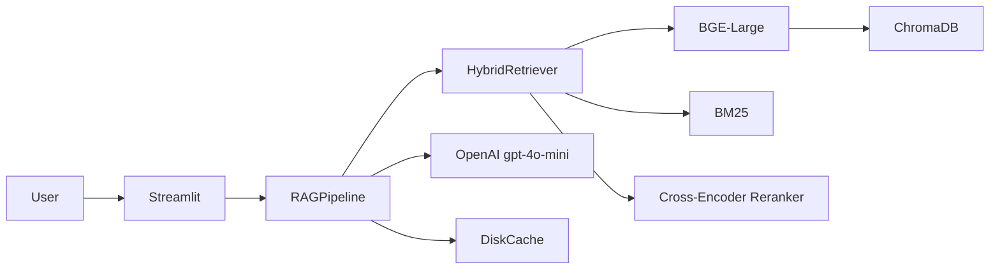

# RAG Evaluation System

> A retrieval-augmented generation (RAG) system built on a fixed corpus with ground truth evaluation. Supports preset questions with scoring and free-form Q&A, with interactive comparison across retrieval configurations.

## Highlights

- End-to-end RAG pipeline — Semantic retrieval (BGE-Large) + BM25 hybrid search + Cross-encoder reranking + LLM generation
- Built-in evaluation — Every preset question shows retrieved sources, ground truth, and F1 score side by side
- Configuration comparison — Switch between retrieval modes and see how results differ on the same question



## Quick Start

```bash
# 1. Clone
git clone https://github.com/vvkkfwq/[TODO: repo-name].git
cd [TODO: repo-name]

# 2. Configure
cp .env.example .env
# Fill in OPENAI_API_KEY in .env

# 3. Build
make build

# 4. Run
make run
# Visit http://localhost:8501
```

## Development Commands

All commands should be run from the repository root.

### Setup & Installation

```bash
# Activate conda environment
conda activate rag

# Install dependencies (if needed)
pip install -r requirements.txt

# Or install pytest for testing
pip install pytest
```

### Build & Index

```bash
# Rebuild Chroma vector store and BM25 index from sample corpus
python -m src.pipeline.ingest

# Build all retrieval indexes with different embedding models
python -m src.pipeline.build_all_indexes

# Compute retrieval metrics on the entire sample-rag.json
python -m src.pipeline.build_metrics
```

### Testing

```bash
# Run all unit tests (fast, no external dependencies)
pytest tests/ -k "not integration" -v

# Run a specific test file
pytest tests/test_rag_pipeline.py -v

# Run with detailed output
pytest tests/ -k "not integration" --tb=short -v

# Run tests with coverage
pytest tests/ -k "not integration" --cov=src --cov-report=html
```

### Running the App

```bash
# Start the Streamlit UI
streamlit run src/ui/app.py

# Run a quick smoke test of the full pipeline
python -m src.pipeline.demo
```

## Demo

## Evaluation Results

> Results on the HotpotQA-style test set using the optimal configuration (BGE-Large + gpt-4o-mini):

## Tech Stack

| Layer            | Technology                            |
| ---------------- | ------------------------------------- |
| Embedding        | BGE-Large (BAAI/bge-large-en-v1.5)    |
| Reranker         | BGE-Reranker (BAAI/bge-reranker-base) |
| Vector Store     | ChromaDB                              |
| Sparse Retrieval | BM25 (rank-bm25)                      |
| Fusion           | Reciprocal Rank Fusion (RRF)          |
| LLM              | OpenAI gpt-4o-mini                    |
| Framework        | LangChain                             |
| UI               | Streamlit                             |
| Cache            | diskcache                             |
| Deploy           | Docker                                |

---

## Project Structure

```
├── src/
│   ├── retriever/       # RAGRetriever, HybridRetriever
│   ├── pipeline/        # Ingestion, RAG pipeline
│   ├── evaluation/      # Retrieval & generation metrics
│   ├── utils/           # Logger, cost tracker
│   └── ui/              # Streamlit pages
├── data/
│   ├── corpus.json      # Fixed knowledge base
│   └── sample-rag.json  # Test set with ground truth
├── Dockerfile
└── docker-compose.yml
```

---

## License

MIT
